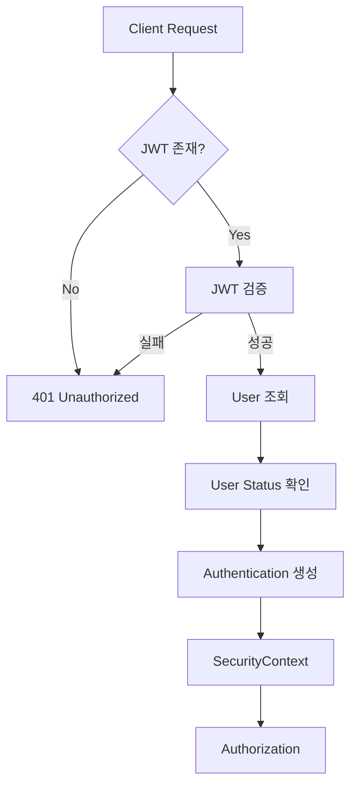
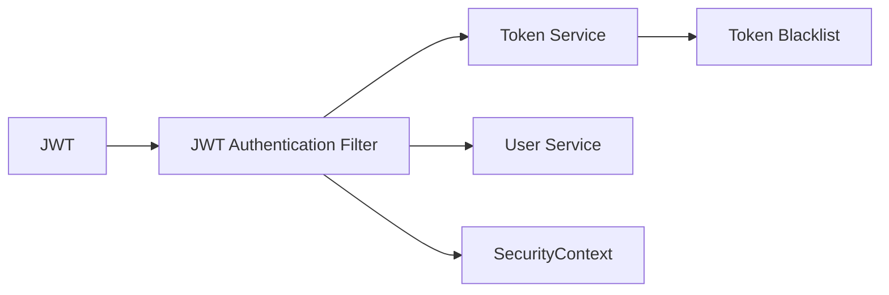
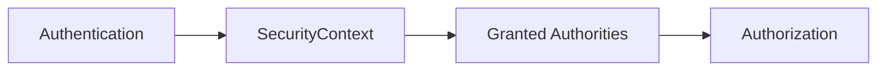

# Authentication

## 1. 인증 구조도 — Mermaid


## 2. 인증 구성요소


## 3. 인증 처리 순서
```md
HTTP Request
    ↓
JWT 추출
    ↓
JWT 검증
    ↓
Blacklist 확인
    ↓
User 조회
    ↓
User Status 확인
    ↓
Authentication 생성
    ↓
SecurityContext 저장
    ↓
Controller
```

## 4. 인증 실패 정책
| 상황           |                   결과 |
| ------------ | -------------------: |
| JWT 없음       |     401 Unauthorized |
| JWT 위조       |     401 Unauthorized |
| JWT 만료       |     401 Unauthorized |
| Blacklist 토큰 |     401 Unauthorized |
| 인증된 사용자      | Authorization 단계로 진행 |
| 비활성 사용자      |                인증 거부 |


## 5. 인증과 인가의 관계


