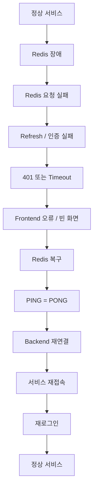
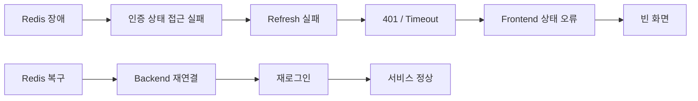

# Redis 장애 및 복구 테스트

## 1. 목적

Redis 장애가 인증 및 Web 서비스에 미치는 영향을 확인하고,
Redis 복구 후 서비스 정상화 여부를 검증한다.


## 2. 테스트 환경

| 항목 | 구성 |
|---|---|
| Runtime | Docker Compose |
| Backend | Spring Boot |
| Database | MySQL |
| Redis | Redis 7 |
| Frontend | Web Application |
| Proxy | Nginx |
| Redis 확인 | `redis-cli ping` |


## 3. 장애 및 복구 흐름




## 4. 테스트 조건

| 항목    | 조건                     |
| ----- | ---------------------- |
| 정상 상태 | Redis `PONG`           |
| 장애 상태 | Redis Container 중지     |
| 장애 확인 | Redis 연결 실패 / Timeout  |
| 복구 상태 | Redis 재기동 + `PONG`     |
| 최종 검증 | Backend / API / Web 정상 |


## 5. 장애 재현

Redis 강제 종료:

```bash
docker kill dev-redis-1
```

Redis 복구:

```bash
docker compose up -d redis
```

Redis 상태 확인:

```bash
docker exec dev-redis-1 redis-cli ping
```

정상 결과:

```text
PONG
```


## 6. 검증 기준

| Scenario     | Expected            |
| ------------ | ------------------- |
| Redis 정상     | 인증 / API 정상         |
| Redis 장애     | 연결 실패 또는 Timeout 발생 |
| Redis 복구     | Backend Redis 재연결   |
| 복구 후 API     | 정상 응답               |
| 복구 후 로그인     | 정상                  |
| 복구 후 Refresh | 정상                  |


## 7. 테스트 결과

| 구분       | Redis 정상 | Redis 장애     | Redis 복구 |
| -------- | -------- | ------------ | -------- |
| Redis    | 정상       | 중지           | 정상       |
| Web 접속   | 정상       | 영향 발생        | 정상       |
| Frontend | 정상       | 빈 화면         | 정상       |
| API      | 정상       | 실패 / Timeout | 정상       |
| Refresh  | 정상       | 401 / 실패     | 정상       |
| 기존 인증 상태 | 정상       | 유지 불가        | 재로그인 필요  |
| 신규 로그인   | 정상       | 불가           | 정상       |


## 8. 주요 로그

Redis 장애 시:

```text
RedisCommandTimeoutException:
Command timed out after 1 minute(s)
```

Redis 재연결 시도:

```text
ConnectionWatchdog:
Reconnecting, last destination was redis:6379
```

Redis 복구 확인:

```text
PONG
```


## 9. 장애 영향



| 문제             | 결과              | 우선순위   |
| -------------- | --------------- | ------ |
| Redis 장애       | 인증 / Refresh 영향 | High   |
| Frontend 예외 처리 | 빈 화면 발생         | High   |
| Redis Timeout  | 최대 1분 대기        | Medium |
| 기존 인증 상태       | 복구 후 재로그인 필요    | Medium |


## 10. 복구 기준

| 검증 항목            | 정상 기준   |
| ---------------- | ------- |
| Redis Container  | Running |
| Redis Ping       | `PONG`  |
| Backend Redis 연결 | 정상      |
| Web 접속           | 정상      |
| Frontend         | 정상 렌더링  |
| 로그인              | 정상      |
| Refresh          | 정상      |
| 서비스 API          | 정상      |


## 11. Verification Status

| 항목           |  상태 |
| ------------ | :-: |
| Redis 장애 재현  |  ✅  |
| Redis 복구     |  ✅  |
| Backend 재연결  |  ✅  |
| API 정상화      |  ✅  |
| Frontend 정상화 |  ⚠️ |
| 인증 상태 복구     |  ⚠️ |

> `Frontend 정상화`는 Redis 복구 후 재접속 및 재로그인 기준으로 정상 동작했으나,
> Redis 장애 중 빈 화면이 발생하여 개선이 필요하다.
>
> `인증 상태 복구`는 기존 세션이 유지되지 않아 재로그인이 필요했다.


## 12. 개선 사항

| 항목            | 개선 방향                           |
| ------------- | ------------------------------- |
| Frontend      | API 장애 시 빈 화면 대신 오류 / 로그인 화면 제공 |
| Redis Timeout | Connection / Command Timeout 단축 |
| Refresh Token | Redis 장애 시 인증 상태 처리 정책 검토       |
| Redis 장애 대응   | Persistence / HA 구성 검토          |


## 13. 결론

Redis 장애 시 인증 및 Refresh 처리에 영향을 주며,
Frontend에서 오류가 적절히 처리되지 않아 빈 화면이 발생한다.

Redis 복구 후 `PONG` 확인 및 Backend 재연결 이후
서비스는 정상화되지만 **기존 인증 상태는 유지되지 않아 재로그인이 필요하다.**

따라서 현재 Redis 복구 자체는 정상이나,
**Redis 장애에 대한 Frontend 예외 처리와 인증 상태 복구 정책은 개선이 필요하다.**


