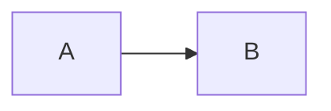

# APMS (Application Permission Management System)

## 프로젝트 소개

APMS(Application Permission Management System)는 JWT 기반 인증(Authentication)과 RBAC(Role-Based Access Control) 기반 인가(Authorization)를 중심으로 설계한 IAM(Identity & Access Management) 플랫폼입니다.

단순 CRUD 구현을 넘어 실제 운영 환경을 고려하여 Docker Compose 기반 컨테이너 환경, Redis 기반 인증 상태 관리, Nginx Reverse Proxy, Prometheus/Grafana 모니터링, GitHub Actions 기반 CI/CD 구조를 적용하였습니다.

사용자, 역할(Role), 권한(Permission), 메뉴(Menu)를 통합 관리할 수 있으며, 인증·권한 시스템을 독립적인 도메인으로 분리하여 확장성과 유지보수성을 확보하는 것을 목표로 하였습니다.

### 주요 목표

* JWT 기반 인증 및 권한 관리 구현
* RBAC(Role-Based Access Control) 적용
* Redis 기반 Refresh Token 및 Blacklist 관리
* Docker Compose 기반 컨테이너 운영 환경 구축
* Prometheus/Grafana 기반 모니터링 환경 구축
* GitHub Actions 기반 CI/CD 자동화
* 운영 환경을 고려한 아키텍처 설계 경험 확보

---

# 아키텍처

## Backend Domain Architecture

```text
auth
├── 인증 및 JWT 처리

iam
├── user
├── role
├── permission
└── menu

audit
├── 감사 로그

monitoring
├── 요청 추적
├── 성능 모니터링

common
├── 예외 처리
├── 공통 응답

infrastructure
├── redis
├── external
```

## System Architecture

```text
Browser
   │
   ▼
Cloudflare
   │
   ▼
Nginx Reverse Proxy
   │
   ├── React Frontend
   │
   └── Spring Boot Backend
             │
      ┌──────┴──────┐
      ▼             ▼
   MySQL         Redis

Spring Actuator
      │
      ▼
 Prometheus
      │
      ▼
   Grafana

node-exporter
cadvisor
```

### 설계 포인트

* 인증(Authentication)과 인가(Authorization) 분리
* Domain 중심 패키지 구조 적용
* Stateless JWT 인증 구조
* Redis 기반 토큰 상태 관리
* Docker 기반 서비스 분리
* 운영 모니터링 환경 구성

---

# 주요 기능

## 인증(Authentication)

* JWT Access Token 발급
* JWT Refresh Token 재발급
* 로그인 / 로그아웃
* 토큰 검증
* Spring Security 연동

### 보안 기능

* Redis Refresh Token 저장
* Redis Blacklist 적용
* JTI 기반 토큰 식별
* Active Session 관리
* Single Session 정책 적용

---

## 권한 관리(IAM)

### User

* 사용자 생성
* 사용자 조회
* 상태 변경
* 사용자 수정

### Role

* 역할 생성
* 역할 수정
* 역할 삭제
* 역할 조회

### Permission

* 권한 생성
* 권한 수정
* 권한 삭제
* 역할 권한 매핑

예시

```text
USER_READ
USER_CREATE
USER_UPDATE
USER_DELETE
```

### Menu

* 메뉴 생성
* 메뉴 수정
* 메뉴 삭제
* 메뉴 권한 매핑

---

## 감사 로그(Audit)

* 로그인 기록
* 로그아웃 기록
* 권한 변경 이력
* 사용자 상태 변경 이력
* 역할 변경 이력

---

## 모니터링(Monitoring)

* JVM Memory
* CPU Usage
* Request Count
* Response Time
* Container Metrics
* Host Metrics

---

# 기술 스택

| 영역         | 기술                      |
| ---------- | ----------------------- |
| Frontend   | React, TypeScript, Vite |
| State      | Zustand, React Query    |
| Backend    | Spring Boot             |
| Security   | Spring Security, JWT    |
| Database   | MySQL 8                 |
| Cache      | Redis 7                 |
| Proxy      | Nginx                   |
| Infra      | Docker, Docker Compose  |
| Monitoring | Prometheus, Grafana     |
| Metrics    | Spring Actuator         |
| DevOps     | GitHub Actions          |
| CDN        | Cloudflare              |

---

# 실행 방법

## 1. Repository Clone

```bash
git clone <repository-url>
```

## 2. 환경 변수 설정

```env
MYSQL_DATABASE=
MYSQL_USER=
MYSQL_PASSWORD=

REDIS_PASSWORD=

JWT_SECRET=
```

## 3. Docker Compose 실행

```bash
docker compose up -d
```

## 4. 상태 확인

```bash
docker ps
```

## 주요 서비스

| Service     | URL                   |
| ----------- | --------------------- |
| Frontend    | http://localhost      |
| Backend API | http://localhost/api  |
| Grafana     | http://localhost:3000 |
| Prometheus  | http://localhost:9090 |

---

# 트러블슈팅

## 1. JWT 로그아웃 문제

### 문제

JWT는 Stateless 구조이므로 발급 이후 서버에서 강제 폐기하기 어렵다.

### 해결

* Redis Blacklist 적용
* JWT JTI 저장
* 요청 시 Blacklist 검증

### 결과

* 즉시 로그아웃 가능
* 토큰 탈취 대응 가능

---

## 2. 중복 로그인 문제

### 문제

동일 계정의 다중 로그인 시 세션 관리가 어려움

### 해결

* Redis Active Session 저장
* JTI 기반 세션 검증
* Single Session 정책 적용

### 결과

* 이전 로그인 세션 자동 무효화

---

## 3. 서비스 기동 순서 문제

### 문제

Backend가 MySQL보다 먼저 실행되어 연결 실패 발생

### 해결

* Docker Health Check 적용
* depends_on + service_healthy 사용

### 결과

* 안정적인 컨테이너 기동 보장

---

# 향후 계획

## 기능 확장

* OAuth2 로그인
* MFA(2차 인증)
* 조직(Organization) 관리
* 사용자 그룹(Group) 관리
* 정책 기반 접근 제어(PBAC)

## 인프라 확장

* Kubernetes 환경 전환
* GitOps 기반 배포 자동화
* Loki 로그 수집
* Alertmanager 장애 알림
* Blue-Green Deployment

## 운영 고도화

* API Rate Limiting 강화
* Redis Cluster 구성
* DB Read Replica 적용
* 장애 복구 시나리오 구축

---

## 프로젝트를 통해 얻은 경험

본 프로젝트를 통해 단순 애플리케이션 개발을 넘어 인증·권한 시스템 설계, 컨테이너 기반 운영, Redis를 활용한 인증 상태 관리, 모니터링 구축, CI/CD 자동화 등 실제 서비스 운영 환경에 필요한 DevOps 및 Backend 아키텍처 역량을 경험할 수 있었습니다.
