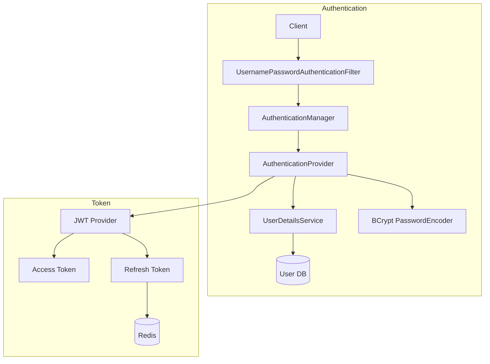
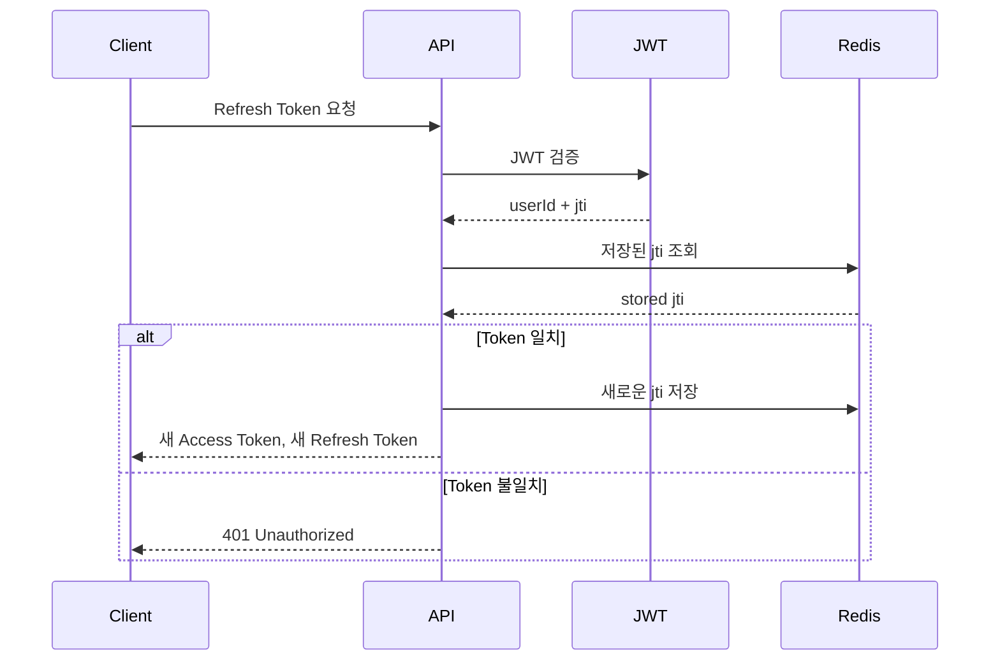

# Authentication Flow

> APMS.SR의 인증(Authentication) 구조와 JWT 기반 인증 정책을 정의한다.


# 1. 목적 (Purpose)

APMS.SR은 **Spring Security 기반 JWT Stateless 인증 구조**를 적용하여 서버 확장성을 확보하고, **Redis 기반 Refresh Token 관리**를 통해 토큰 재발급과 로그아웃을 안전하게 처리하는 것을 목표로 한다.

## 설계 목표

| 목표                  | 적용 방식                  |
| ------------------- | ---------------------- |
| Stateless 인증        | JWT Access Token       |
| 서버 확장성              | Session 미사용            |
| 안전한 재발급             | Refresh Token + Redis  |
| 로그아웃 처리             | Redis Refresh Token 삭제 |
| Refresh Token 탈취 대응 | Rotation 적용            |
| 비밀번호 보호             | BCrypt PasswordEncoder |


# 2. 전체 인증 구조 (Architecture Overview) 머메이드




# 3. 로그인 인증 흐름

```text
Client
    │
    ▼
Login Request
    │
    ▼
AuthenticationManager
    │
    ▼
UserDetailsService
    │
    ▼
User 조회
    │
    ▼
BCrypt Password 비교
    │
    ▼
인증 성공
    │
    ▼
Access Token 발급
Refresh Token 발급
    │
    ▼
Redis Refresh Token 저장
    │
    ▼
Client 응답
```


# 4. API 인증 흐름

```text
Client

Authorization: Bearer Access Token

        │
        ▼
Security Filter Chain
        │
        ▼
JWT Authentication Filter
        │
        ▼
JWT Signature 검증
Expiration 검증
Claim 추출
        │
        ▼
Authentication 생성
        │
        ▼
SecurityContext 저장
        │
        ▼
Controller 실행
```


# 5. JWT Token 정책

| 구분    | Access Token | Refresh Token    |
| ----- | ------------ | ---------------- |
| 목적    | API 인증       | Access Token 재발급 |
| 저장 위치 | Client       | Client + Redis   |
| 서버 저장 | 저장하지 않음      | Redis            |
| 만료 시간 | 짧게 설정        | 길게 설정            |
| 재발급   | 불가           | 가능               |
| 로그아웃  | 만료까지 유지      | Redis 삭제         |


# 6. Redis Refresh Token 관리

## 저장 구조

```text
Key

auth:refresh:user:{userId}

Value

Refresh Token(JTI 또는 Token)

TTL

Refresh Token 만료시간
```

예시

```text
auth:refresh:user:10001

↓

550e8400-e29b...

TTL

7 days
```

Redis를 사용하는 이유

* 빠른 조회(O(1))
* TTL 자동 만료
* 로그아웃 시 즉시 삭제
* Refresh Token 중앙 관리


# 7. Refresh Token Rotation

```text
Refresh Token A

↓

검증 성공

↓

기존 Refresh Token 폐기

↓

새 Refresh Token B 생성

↓

Redis 갱신

↓

Client 응답
```

## Rotation 목적

* Refresh Token 재사용 방지
* 탈취 피해 최소화
* 보안성 향상


# 8. Refresh 재발급 흐름 머메이드




# 9. Security Filter 책임

| 구성 요소                     | 역할             |
| ------------------------- | -------------- |
| SecurityFilterChain       | 전체 보안 정책 구성    |
| JWT Authentication Filter | JWT 검증         |
| AuthenticationManager     | 로그인 인증 처리      |
| UserDetailsService        | 사용자 조회         |
| PasswordEncoder           | BCrypt 비밀번호 검증 |
| SecurityContext           | 인증 정보 저장       |


# 10. JwtProvider 책임

JwtProvider는 다음 역할을 수행한다.

* JWT 생성
* JWT 파싱
* Signature 검증
* Expiration 검증
* Claim 추출


# 11. 인증 예외 처리

| 상황                      | 결과               |
| ----------------------- | ---------------- |
| Authorization Header 없음 | 401 Unauthorized |
| JWT 만료                  | 401 Unauthorized |
| Signature 오류            | 401 Unauthorized |
| Refresh Token 불일치       | 401 Unauthorized |
| Refresh Token 만료        | 재로그인             |
| 권한 부족                   | 403 Forbidden    |


# 12. 운영 고려사항

| 상황                | 처리 방식                                         |
| ----------------- | --------------------------------------------- |
| 로그아웃              | Redis Refresh Token 삭제                        |
| Access Token 만료   | Refresh Token으로 재발급                           |
| Refresh Token 만료  | 재로그인                                          |
| Refresh Token 재사용 | Rotation 실패 → 재로그인                            |
| Redis 장애          | 기존 Access Token은 만료 전까지 사용 가능, Refresh 재발급 제한 |


# 13. 설계 결정

| 선택                     | 이유                        |
| ---------------------- | ------------------------- |
| Spring Security        | 표준 인증 프레임워크 활용            |
| JWT                    | Stateless 인증으로 서버 확장성 확보  |
| BCrypt                 | 비밀번호 단방향 암호화              |
| Redis                  | Refresh Token 저장 및 TTL 관리 |
| Refresh Token Rotation | 재사용 공격 방지                 |
| SecurityContext        | 요청 단위 인증 정보 관리            |


