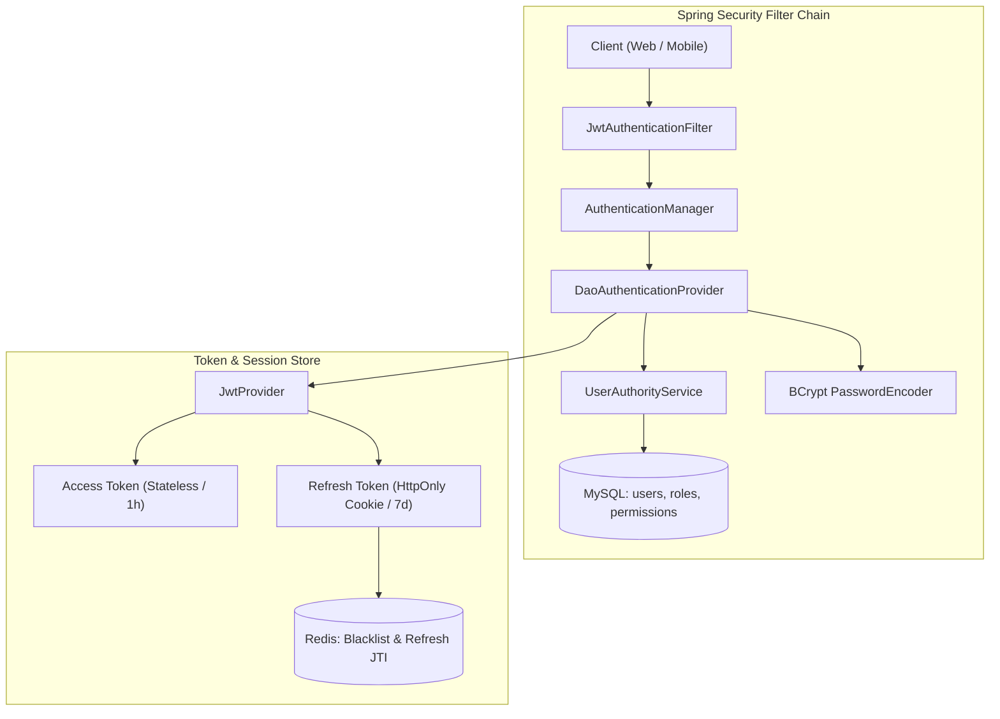
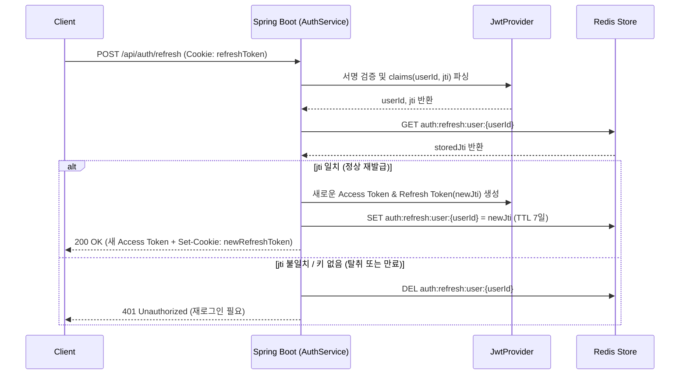

# [Reference] 시스템 보안 및 인증·인가 아키텍처 (Security & RBAC Reference)

- **Version:** 1.0.0
- **Last Updated:** 2026-08-26
- **Status:** Active
- **Applied Tech Stack:** Spring Security 6, JJWT (0.12.x), Redis 7, Spring Data JPA, BCrypt

본 문서는 `APMS.SR` 시스템의 Spring Security 기반 **JWT Stateless 인증 구조**, **Redis 기반 세션 및 토큰 제어**, **RBAC(Role-Based Access Control) 인가 정책**의 단일 진실 공급원(Single Source of Truth) 기준 문서입니다.

---

## 1. 보안 아키텍처 개요 (Security Architecture Overview)

시스템은 완전한 Stateless 인증 아키텍처를 지향하며, 토큰 무효화(Logout) 및 재발급 보안(RTR)을 위해 Redis를 보조 인메모리 저장소로 결합하여 사용합니다.

### 1) 시스템 컴포넌트 아키텍처


### 2) 핵심 보안 설계 목표
| 목표 | 적용 기술 및 정책 | 기대 효과 |
| :--- | :--- | :--- |
| **Stateless 인증** | JWT Access Token | 서버 세션 메모리 부하 제거 및 수평 확장(Scale-out) 용이 |
| **비밀번호 보호** | BCrypt PasswordEncoder | 단방향 솔팅 해시를 통한 암호화 저장 |
| **안전한 세션 갱신** | Refresh Token Rotation (RTR) + Redis | 탈취된 Refresh Token 재사용 방지 및 세션 무효화 |
| **즉시 로그아웃** | Redis Access Token Blacklist (TTL) | JWT 특유의 유효기간 잔여 토큰 즉시 무력화 |
| **세분화된 접근제어** | RBAC (Role ➡️ Permission ➡️ Authority) | `@PreAuthorize` 기반의 메서드/엔드포인트 단위 인가 제어 |

---

## 2. 인증 메커니즘 및 흐름 (Authentication Flow)

### 1) 로그인 인증 흐름 (Login Flow)
```text
Client
  │ (POST /api/auth/login with username, password)
  ▼
AuthenticationManager
  │
  ▼
UserAuthorityService (사용자 및 Role/Permission Fetch Join 조회)
  │
  ▼
BCrypt Password 검증
  │
  ├─ [실패] ➡️ 401 Unauthorized (GlobalExceptionHandler)
  │
  └─ [성공] ➡️ JwtProvider (Access Token, Refresh Token 생성)
       │
       ├─ Redis에 Refresh Token (JTI) 저장 (TTL 7일)
       │
       └─ Client에 Access Token(JSON Body) 및 Refresh Token(HttpOnly Cookie) 반환
```

### 2) API 요청 인증 흐름 (API Request Flow)
```text
Client (Authorization: Bearer <Access Token>)
  │
  ▼
SecurityFilterChain (JwtAuthenticationFilter)
  │
  ├─ 1. Header에서 JWT 파싱 및 Signature / Expiration 유효성 검증
  │     └─ 검증 실패 시: SecurityContext 적재 없이 통과 (이후 인가 단계에서 401 반환)
  │
  ├─ 2. Redis Blacklist 확인 (`redisTemplate.hasKey("blacklist:" + token)`)
  │     └─ Blacklist 등재 토큰일 경우: 즉시 차단 (401 Unauthorized)
  │
  ├─ 3. Claims에서 userId / username 추출 후 UserAuthorityService 호출
  │
  ├─ 4. DB에서 Fetch Join으로 권한(Permissions) 조회 및 CustomUserPrincipal 생성
  │
  ├─ 5. SecurityContextHolder.getContext().setAuthentication(...) 적재
  │
  ▼
DispatcherServlet ➡️ Controller 진입
```

### 3) JWT 토큰 정책 (Token Policy)
| 구분 | Access Token | Refresh Token |
| :--- | :--- | :--- |
| **용도** | API 호출 인가 인증 | Access Token 갱신 |
| **보관 위치** | Client 메모리 / Zustand 상태 | Client: `HttpOnly`, `SameSite=Strict` Cookie<br>Server: Redis Key-Value |
| **유효 기간** | 1시간 (`3,600,000 ms`) | 7일 (`604,800,000 ms`) |
| **포함 클레임** | `sub`(userId), `roles`, `exp`, `iat` | `sub`(userId), `jti`(UUID), `exp`, `iat` |
| **로그아웃 처리**| Redis Blacklist에 잔여 TTL 동안 등록 | Redis에서 해당 유저 키 즉시 삭제 (`DEL`) |

### 4) Refresh Token Rotation (RTR) 및 Redis 관리
* **저장 키 구조:** `auth:refresh:user:{userId}` ➡️ `Value: {jti}`, `TTL: 7일`
* **Rotation 절차:**
  1. 클라이언트가 `/api/auth/refresh` 요청 (쿠키에 Refresh Token 전송).
  2. 서버가 Refresh Token의 서명과 만료일을 검증하고 `userId`와 `jti`를 추출.
  3. Redis에 저장된 `jti`와 비교:
     - **일치:** 새로운 Access Token 및 신규 JTI의 Refresh Token 발급 ➡️ Redis 덮어쓰기.
     - **불일치 (재사용 감지):** 토큰 탈취로 간주 ➡️ Redis에서 해당 사용자의 Refresh Token 즉시 삭제 ➡️ 401 응답 및 강제 재로그인.



---

## 3. 인가 메커니즘 (Authorization Flow & Policy)

### 1) Role ➡️ Permission ➡️ Granted Authorities 구조
시스템은 사용자가 보유한 **Role**로부터 세부 **Permission**을 도출하여 Spring Security의 `GrantedAuthority`로 변환합니다.

```mermaid
flowchart LR
    User["User (Entity)"] -->|"@ManyToMany"| Role["Role (Entity)"]
    Role -->|"@ManyToMany"| Permission["Permission (Entity)"]
    Permission -->|"UserAuthorityService"| Authority["SimpleGrantedAuthority (Permission Name)"]
    Authority -->|"SecurityContext"| PreAuth["@PreAuthorize(\"hasAuthority('ROLE_CREATE')\")"]
```

### 2) API 접근 제어 및 HTTP 상태 코드 기준
| 상황 | HTTP Status | 에러 메시지 및 사유 |
| :--- | :---: | :--- |
| **인증되지 않은 요청** (헤더 누락, 서명 불일치, 토큰 만료) | `401 Unauthorized` | "인증에 실패하였습니다. (Authentication Required)" |
| **블랙리스트 토큰 요청** (로그아웃된 토큰 재사용) | `401 Unauthorized` | "무효화된 토큰입니다. 다시 로그인해 주세요." |
| **인가 권한 부족** (정상 로그인 상태이나 해당 엔드포인트 권한 없음) | `403 Forbidden` | "접근 권한이 없습니다. (Access Denied)" |
| **정상 인가 완료** | `200 OK` / `201 Created` | 요청 성공 및 비즈니스 데이터 반환 |

---

## 4. RBAC 역할 및 권한 매트릭스 (RBAC Matrix)

### 1) 시스템 역할 (Role) 정의
* **`USER`**: 일반 사용자. 본인 정보 조회 및 기본 비즈니스(메뉴 등) 조회 권한 보유.
* **`ADMIN`**: 시스템 관리자. 사용자 관리, 역할 및 권한 관리, 시스템 리소스 제어 전체 권한 보유.

### 2) 세부 권한 (Permission) 목록
| Permission | 설명 | 주요 적용 대상 |
| :--- | :--- | :--- |
| **`USER_READ`** | 사용자 목록 및 상세 정보 조회 | `/api/users/me`, `/api/admin/users` |
| **`USER_DELETE`**| 사용자 계정 비활성화 / 삭제 | `/api/admin/users/{id}` |
| **`ROLE_READ`** | 역할 및 권한 정보 조회 | `/api/admin/roles`, `/api/admin/permissions` |
| **`ROLE_CREATE`**| 신규 역할 생성 | `POST /api/admin/roles` |
| **`ROLE_UPDATE`**| 역할 정보 및 권한 매핑 수정 | `PUT /api/admin/roles/{id}` |
| **`ROLE_DELETE`**| 역할 삭제 | `DELETE /api/admin/roles/{id}` |
| **`ROLE_ASSIGN`**| 역할에 세부 권한 할당/해제 | `POST /api/admin/roles/{id}/permissions` |
| **`MENU_READ`** | 서비스 메뉴 목록 조회 | `/api/menus` |

### 3) Role / Permission 매핑 매트릭스
| Permission | `USER` (일반 사용자) | `ADMIN` (관리자) |
| :--- | :---: | :---: |
| **`USER_READ`** | ✅ | ✅ |
| **`USER_DELETE`** | ❌ | ✅ |
| **`ROLE_READ`** | ❌ | ✅ |
| **`ROLE_CREATE`** | ❌ | ✅ |
| **`ROLE_UPDATE`** | ❌ | ✅ |
| **`ROLE_DELETE`** | ❌ | ✅ |
| **`ROLE_ASSIGN`** | ❌ | ✅ |
| **`MENU_READ`** | ✅ | ✅ |

---

## 5. 보안 필터 및 전역 예외 처리 규약

1. **SecurityFilterChain 순서:**
   - `CorsFilter` ➡️ `JwtAuthenticationFilter` ➡️ `UsernamePasswordAuthenticationFilter` ➡️ `AuthorizationFilter`
2. **GlobalExceptionHandler 연동:**
   - `AccessDeniedException` ➡️ `403 Forbidden` (`ApiResponse.error("접근 권한이 없습니다.")`)
   - `BadCredentialsException`, `AuthenticationException` ➡️ `401 Unauthorized` (`ApiResponse.error("인증에 실패하였습니다.")`)
   - `RedisUnavailableException` ➡️ `503 Service Unavailable` 또는 안전한 Fallback 에러 반환.
