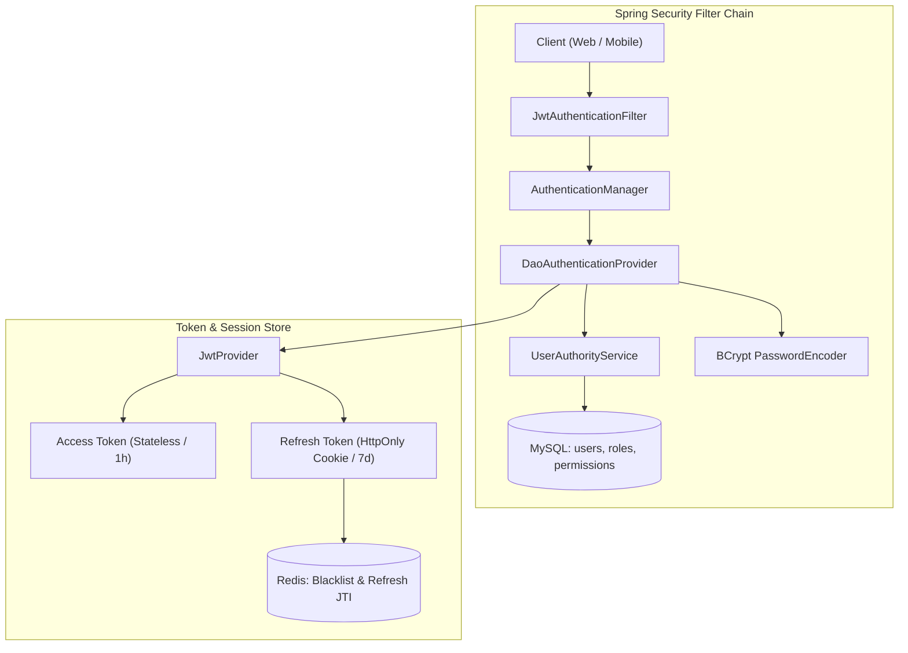
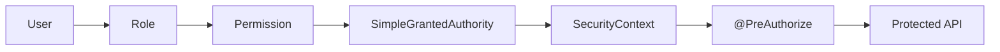

# [Reference] 시스템 보안 및 인증·인가 아키텍처 (Security & RBAC Reference)

* **Version:** 1.0.0
* **Last Updated:** 2026-08-30
* **Status:** Active
* **Applied Tech Stack:** Spring Security 6, JJWT (0.12.x), Redis 7, Spring Data JPA, BCrypt

본 문서는 `APMS.SR` 시스템의 **JWT 기반 인증(Authentication)**, **Redis 기반 토큰 제어**, **RBAC(Role-Based Access Control) 기반 인가(Authorization)** 정책을 정의하는 기준 문서이다.

특히 본 문서의 §4는 시스템에서 사용하는 **Role / Permission / API 인가 정책의 Single Source of Truth(SSOT)** 로 사용한다.

Permission 또는 Role 정책이 변경되는 경우 DB migration, Backend Authority, API, Frontend Permission 사용 및 Security Test와 함께 본 문서를 갱신해야 한다.

---

# 1. 보안 아키텍처 개요 (Security Architecture Overview)

시스템은 JWT 기반 Stateless 인증을 사용하며, Refresh Token 관리와 토큰 무효화를 위해 Redis를 보조 저장소로 사용한다.

## 1.1 시스템 컴포넌트 아키텍처



## 1.2 핵심 보안 설계 목표

| 목표               | 적용 기술 및 정책                             | 기대 효과                        |
| :--------------- | :------------------------------------- | :--------------------------- |
| **Stateless 인증** | JWT Access Token                       | 서버 세션 메모리 부하 제거 및 수평 확장 용이   |
| **비밀번호 보호**      | BCrypt PasswordEncoder                 | 단방향 솔팅 해시를 통한 안전한 저장         |
| **안전한 세션 갱신**    | Refresh Token Rotation (RTR) + Redis   | 탈취된 Refresh Token 재사용 방지     |
| **즉시 로그아웃**      | Redis Access Token Blacklist (TTL)     | 로그아웃된 Access Token의 재사용 차단   |
| **세분화된 접근제어**    | RBAC (`Role → Permission → Authority`) | `@PreAuthorize` 기반 API 단위 인가 |

---

# 2. 인증 메커니즘 및 흐름 (Authentication Flow)

## 2.1 로그인 인증 흐름

```text
Client
  │
  │ POST /api/auth/login
  │ username + password
  ▼
AuthenticationManager
  │
  ▼
UserAuthorityService
  │
  ├─ User 및 Role / Permission 조회
  │
  ▼
BCrypt Password 검증
  │
  ├─ 실패 → 401 Unauthorized
  │
  └─ 성공
       │
       ▼
   JwtProvider
       │
       ├─ Access Token 생성
       ├─ Refresh Token 생성
       └─ Refresh JTI → Redis 저장
       │
       ▼
Client
```

## 2.2 API 요청 인증 흐름

```text
Client
  │
  │ Authorization: Bearer <Access Token>
  ▼
SecurityFilterChain
  │
  ▼
JwtAuthenticationFilter
  │
  ├─ JWT Signature / Expiration 검증
  │
  ├─ Redis Blacklist 확인
  │
  ├─ Claims에서 userId / username 추출
  │
  ├─ UserAuthorityService 호출
  │
  ├─ DB에서 User → Role → Permission 조회
  │
  └─ CustomUserPrincipal 생성
  │
  ▼
SecurityContextHolder
  │
  ▼
Controller
```

## 2.3 JWT Token Policy

| 구분         | Access Token                 | Refresh Token                                             |
| :--------- | :--------------------------- | :-------------------------------------------------------- |
| **용도**     | API 호출 인증/인가                 | Access Token 갱신                                           |
| **보관 위치**  | Client 메모리 / Zustand 상태      | Client: HttpOnly + SameSite=Strict Cookie / Server: Redis |
| **유효 기간**  | 1시간 (`3,600,000 ms`)         | 7일 (`604,800,000 ms`)                                     |
| **주요 클레임** | `sub`, `roles`, `exp`, `iat` | `sub`, `jti`, `exp`, `iat`                                |
| **로그아웃**   | Redis Blacklist 등록           | Redis의 사용자 Refresh JTI 삭제                                 |

## 2.4 Refresh Token Rotation

Refresh Token은 Redis에 사용자별 JTI를 저장하여 재사용 여부를 검증한다.

```text
Client
  │
  │ POST /api/auth/refresh
  │ Cookie: refreshToken
  ▼
JwtProvider
  │
  ├─ Signature 검증
  ├─ Expiration 검증
  └─ userId / jti 추출
  │
  ▼
Redis
  │
  └─ auth:refresh:user:{userId}
       │
       ├─ JTI 일치
       │    └─ 신규 Access Token + Refresh Token 발급
       │       └─ Redis JTI 갱신
       │
       └─ JTI 불일치 / Key 없음
            └─ Refresh Token 재사용 또는 만료
               └─ Redis Key 삭제
                  └─ 401 Unauthorized
```

---

# 3. 인가 메커니즘 (Authorization Flow & Policy)

## 3.1 Role → Permission → GrantedAuthority

시스템의 RBAC 인가 구조는 다음과 같다.



즉, 사용자가 직접 API Permission을 보유하는 것이 아니라 다음 관계를 통해 권한이 결정된다.

```text
User
  ↓
Role
  ↓
Permission
  ↓
GrantedAuthority
  ↓
@PreAuthorize
  ↓
Protected API
```

## 3.2 HTTP 상태 코드 기준

| 상황                    |        HTTP Status       | 의미         |
| :-------------------- | :----------------------: | :--------- |
| 인증 정보 없음 / 유효하지 않은 인증 |    `401 Unauthorized`    | 인증 필요      |
| Blacklist Token 사용    |    `401 Unauthorized`    | 무효화된 Token |
| 인증은 되었으나 권한 부족        |      `403 Forbidden`     | 접근 권한 없음   |
| 정상 인가                 | `200 OK` / `201 Created` | 요청 성공      |

---

# 4. RBAC 역할 및 권한 매트릭스 (RBAC SSOT)

> **본 절은 APMS.SR RBAC 정책의 Single Source of Truth(SSOT)이다.**
>
> Permission의 존재 여부, API 보호 정책, Role-Permission 관계가 변경되면 본 절과 관련 DB migration 및 Security Test를 함께 갱신해야 한다.

---

## 4.1 시스템 역할 (Role)

### `USER`

일반 사용자 Role.

* 본인 및 허용된 기본 기능 접근
* 메뉴 조회
* 관리자 전용 관리 기능 접근 불가

### `ADMIN`

시스템 관리자 Role.

* 사용자 관리
* 사용자 Role 관리
* Role 관리
* Role-Permission 관리
* Menu 관리
* Permission 조회

등 관리자 기능에 필요한 Permission을 보유한다.

---

## 4.2 Permission 정의

현재 시스템에서 사용하는 Permission은 **총 14개**이다.

| Permission           | 보호 대상                                                           | 설명                  |
| :------------------- | :-------------------------------------------------------------- | :------------------ |
| `USER_READ`          | `GET /api/admin/users`                                          | 사용자 조회              |
| `USER_STATUS_UPDATE` | `PATCH /api/admin/users/{id}/status`                            | 사용자 상태 변경           |
| `USER_DELETE`        | `DELETE /api/admin/users/{id}`                                  | 사용자 삭제/비활성화         |
| `USER_ROLE_MANAGE`   | `POST /api/admin/users/{id}/roles`                              | 사용자의 Role 변경        |
| `ROLE_READ`          | `GET /api/admin/roles`                                          | Role 조회             |
| `ROLE_CREATE`        | `POST /api/admin/roles`                                         | Role 생성             |
| `ROLE_UPDATE`        | `PATCH /api/admin/roles/{id}`                                   | Role 수정             |
| `ROLE_DELETE`        | `DELETE /api/admin/roles/{id}`                                  | Role 삭제             |
| `ROLE_ASSIGN`        | `POST /api/admin/roles/{id}/permissions`                        | Role에 Permission 할당 |
| `MENU_READ`          | `GET /api/admin/menus`, `GET /api/admin/menus/{id}`             | Menu 조회             |
| `MENU_CREATE`        | `POST /api/admin/menus`                                         | Menu 생성             |
| `MENU_UPDATE`        | `PATCH /api/admin/menus/{id}`                                   | Menu 수정             |
| `MENU_DELETE`        | `DELETE /api/admin/menus/{id}`                                  | Menu 삭제             |
| `PERMISSION_READ`    | `GET /api/admin/permissions`, `GET /api/admin/permissions/{id}` | Permission 조회       |

### Permission 분류

```text
USER
├─ USER_READ
├─ USER_STATUS_UPDATE
├─ USER_DELETE
└─ USER_ROLE_MANAGE

ROLE
├─ ROLE_READ
├─ ROLE_CREATE
├─ ROLE_UPDATE
├─ ROLE_DELETE
└─ ROLE_ASSIGN

MENU
├─ MENU_READ
├─ MENU_CREATE
├─ MENU_UPDATE
└─ MENU_DELETE

PERMISSION
└─ PERMISSION_READ
```

---

## 4.3 Permission → API 매핑

Permission은 단순히 DB에 존재하는 식별자가 아니라 실제 보호 대상 API와 연결되어야 한다.

### User Authorization

| Operation        | Permission           | Endpoint                             |
| :--------------- | :------------------- | :----------------------------------- |
| Read             | `USER_READ`          | `GET /api/admin/users`               |
| Status Update    | `USER_STATUS_UPDATE` | `PATCH /api/admin/users/{id}/status` |
| Delete / Disable | `USER_DELETE`        | `DELETE /api/admin/users/{id}`       |
| Role Management  | `USER_ROLE_MANAGE`   | `POST /api/admin/users/{id}/roles`   |

### Role Authorization

| Operation             | Permission    | Endpoint                                 |
| :-------------------- | :------------ | :--------------------------------------- |
| Read                  | `ROLE_READ`   | `GET /api/admin/roles`                   |
| Create                | `ROLE_CREATE` | `POST /api/admin/roles`                  |
| Update                | `ROLE_UPDATE` | `PATCH /api/admin/roles/{id}`            |
| Delete                | `ROLE_DELETE` | `DELETE /api/admin/roles/{id}`           |
| Permission Assignment | `ROLE_ASSIGN` | `POST /api/admin/roles/{id}/permissions` |

### Menu Authorization

| Operation   | Permission    | Endpoint                       |
| :---------- | :------------ | :----------------------------- |
| Read        | `MENU_READ`   | `GET /api/admin/menus`         |
| Read Detail | `MENU_READ`   | `GET /api/admin/menus/{id}`    |
| Create      | `MENU_CREATE` | `POST /api/admin/menus`        |
| Update      | `MENU_UPDATE` | `PATCH /api/admin/menus/{id}`  |
| Delete      | `MENU_DELETE` | `DELETE /api/admin/menus/{id}` |

> **중요:** Menu 기능은 조회(`MENU_READ`)만 존재하는 것이 아니다.
> 생성·수정·삭제는 각각 `MENU_CREATE`, `MENU_UPDATE`, `MENU_DELETE`로 별도 보호한다.

### Permission Authorization

| Operation   | Permission        | Endpoint                          |
| :---------- | :---------------- | :-------------------------------- |
| Read        | `PERMISSION_READ` | `GET /api/admin/permissions`      |
| Read Detail | `PERMISSION_READ` | `GET /api/admin/permissions/{id}` |

---

## 4.4 Role → Permission Matrix

현재 시스템의 기본 Role-Permission 관계는 다음과 같다.

| Permission           | `USER` | `ADMIN` |
| :------------------- | :----: | :-----: |
| `USER_READ`          |    ✅   |    ✅    |
| `USER_STATUS_UPDATE` |    ❌   |    ✅    |
| `USER_DELETE`        |    ❌   |    ✅    |
| `USER_ROLE_MANAGE`   |    ❌   |    ✅    |
| `ROLE_READ`          |    ❌   |    ✅    |
| `ROLE_CREATE`        |    ❌   |    ✅    |
| `ROLE_UPDATE`        |    ❌   |    ✅    |
| `ROLE_DELETE`        |    ❌   |    ✅    |
| `ROLE_ASSIGN`        |    ❌   |    ✅    |
| `MENU_READ`          |    ✅   |    ✅    |
| `MENU_CREATE`        |    ❌   |    ✅    |
| `MENU_UPDATE`        |    ❌   |    ✅    |
| `MENU_DELETE`        |    ❌   |    ✅    |
| `PERMISSION_READ`    |    ❌   |    ✅    |

> **Matrix 기준**
>
> 본 표는 Backend RBAC 구현 및 DB migration seed 결과를 기준으로 작성한다.
>
> Permission의 존재 여부는 개별 migration 파일이 아닌 **전체 migration chain**을 기준으로 판단한다.
>
> Role에 대한 Permission 부여 여부는 `role_permissions` seed 결과를 기준으로 판단한다.

---

## 4.5 User → Role과 Role → Permission 관리

RBAC에는 서로 다른 두 종류의 관계 관리가 존재한다.

```text
User → Role
Role → Permission
```

두 관계는 서로 다른 Permission으로 보호된다.

| 관리 관계                 | Permission         | API                                          | 의미                         |
| :-------------------- | :----------------- | :------------------------------------------- | :------------------------- |
| **User → Role**       | `USER_ROLE_MANAGE` | `POST /api/admin/users/{userId}/roles`       | 특정 User가 보유할 Role 변경       |
| **Role → Permission** | `ROLE_ASSIGN`      | `POST /api/admin/roles/{roleId}/permissions` | 특정 Role이 보유할 Permission 변경 |

### 관계의 의미

```text
USER_ROLE_MANAGE

User
 └─ Role 변경
      ├─ Role 추가
      ├─ Role 변경
      └─ Role 해제


ROLE_ASSIGN

Role
 └─ Permission 변경
      ├─ Permission 추가
      ├─ Permission 변경
      └─ Permission 해제
```

따라서 두 Permission은 통합하지 않는다.

* `USER_ROLE_MANAGE` = **User의 Role 구성 관리**
* `ROLE_ASSIGN` = **Role의 Permission 구성 관리**

---

## 4.6 User Role Assignment

`USER_ROLE_MANAGE`는 특정 사용자의 Role 구성을 변경하는 관리자 기능이다.

### API

| 항목                      | 내용                                     |
| :---------------------- | :------------------------------------- |
| **Method / Path**       | `POST /api/admin/users/{userId}/roles` |
| **Request Body**        | `{ "roleIds": [Long, ...] }`           |
| **Required Permission** | `USER_ROLE_MANAGE`                     |
| **동작 방식**               | 전체 교체 (Full Replace)                   |
| **`roleIds = []`**      | 모든 Role 해제                             |
| **존재하지 않는 Role ID**     | `400 Bad Request`                      |
| **성공 응답**               | `200 OK`                               |

### Full Replace Semantics

```text
기존 Role
[USER, ADMIN]

요청
roleIds = [1, 2]

결과
[Role 1, Role 2]
```

즉, `roleIds`에 전달된 Role이 최종 상태가 된다.

```text
roleIds = [1, 2]
→ Role 1, Role 2만 보유

roleIds = []
→ 모든 Role 해제
```

> **부분 추가(Append)는 지원하지 않는다.**
>
> 기존 Role을 유지하면서 새로운 Role을 추가하려면 현재 Role 목록을 조회한 후 기존 목록과 신규 Role을 병합하여 요청해야 한다.

### 구현 기준

`USER_ROLE_MANAGE`는 V6 migration에서 `permissions`에 등록되고 ADMIN Role에 매핑된다.

따라서 이 Permission의 존재 여부는 `V4__insert_permissions.sql` 단일 파일이 아니라 **전체 migration chain(V1~V6)** 을 기준으로 판단한다.

---

## 4.7 RBAC Authorization Flow

전체 RBAC 인가 흐름은 다음과 같다.

```text
User
 │
 ▼
Role
 │
 ▼
Permission
 │
 ▼
SimpleGrantedAuthority
 │
 ▼
SecurityContext
 │
 ▼
@PreAuthorize
 │
 ▼
Controller
 │
 ▼
Service
```

Backend에서는 사용자의 Role과 Permission을 조회하여 `GrantedAuthority`로 변환하고, Controller의 `@PreAuthorize`가 해당 Authority를 기준으로 접근 여부를 판단한다.

예:

```java
@PreAuthorize("hasAuthority('USER_ROLE_MANAGE')")
```

```java
@PreAuthorize("hasAuthority('MENU_CREATE')")
```

```java
@PreAuthorize("hasAuthority('ROLE_ASSIGN')")
```

### Role 변경 반영

User의 Role 변경 이후 해당 사용자의 다음 API 요청에서 User → Role → Permission 관계를 다시 조회하여 새로운 `GrantedAuthority`가 구성된다.

따라서 Role 변경 자체와 Access Token의 즉시 무효화는 별개의 정책이다.

> **참고:** 본 문서에서는 Role 변경에 따른 권한 재조회 흐름을 정의하지만, Role 변경 시 기존 Access Token을 즉시 Blacklist 처리하는 정책은 `USER_ROLE_MANAGE` API의 범위에 포함하지 않는다.

---

## 4.8 RBAC SSOT 정합성 규칙

RBAC 정책은 다음 계층 간 정합성을 유지해야 한다.

```text
DB Migration / Seed
        ↓
Permission Entity
        ↓
GrantedAuthority
        ↓
Controller @PreAuthorize
        ↓
API / Service
        ↓
Frontend Permission Usage
        ↓
Security Tests
        ↓
security.md
```

다음 조건을 만족해야 한다.

1. **DB에 seed된 Permission은 본 문서에 정의되어야 한다.**
2. **Controller에서 사용하는 Permission은 본 문서에 정의되어야 한다.**
3. **실제로 보호되는 RBAC API는 대응 Permission을 가져야 한다.**
4. **Role-Permission Matrix는 DB seed 결과와 일치해야 한다.**
5. **Security Test는 정의된 Permission의 허용/거부 동작을 검증해야 한다.**
6. **Frontend가 Permission을 기준으로 접근을 제어하는 경우 동일한 Permission 문자열을 사용해야 한다.**
7. **Permission 추가·삭제·변경 시 관련 Backend, Frontend, Test 및 문서를 함께 검토해야 한다.**
8. **개별 migration 파일만으로 Permission 존재 여부를 판단하지 않고 전체 migration chain을 기준으로 판단한다.**

### RBAC SSOT 검증 관계

```text
                ┌──────────────────┐
                │  DB Migration    │
                └────────┬─────────┘
                         │
                         ▼
                ┌──────────────────┐
                │    Permission    │
                └────────┬─────────┘
                         │
          ┌──────────────┼──────────────┐
          ▼              ▼              ▼
     Backend API      Frontend      Security Test
          │              │              │
          └──────────────┼──────────────┘
                         ▼
                ┌──────────────────┐
                │  security.md     │
                │      SSOT        │
                └──────────────────┘
```

---

# 5. 보안 필터 및 전역 예외 처리 규약

## 5.1 SecurityFilterChain

기본적인 보안 필터 흐름은 다음 순서를 따른다.

```text
CorsFilter
    ↓
JwtAuthenticationFilter
    ↓
UsernamePasswordAuthenticationFilter
    ↓
AuthorizationFilter
```

## 5.2 전역 예외 처리

| Exception / 상황              |                HTTP Status                | 처리                                  |
| :-------------------------- | :---------------------------------------: | :---------------------------------- |
| `AccessDeniedException`     |              `403 Forbidden`              | `ApiResponse.error("접근 권한이 없습니다.")` |
| `BadCredentialsException`   |             `401 Unauthorized`            | 인증 실패 응답                            |
| `AuthenticationException`   |             `401 Unauthorized`            | 인증 실패 응답                            |
| `RedisUnavailableException` | `503 Service Unavailable` 또는 안전한 Fallback | Redis 장애 처리                         |

---

# 6. Security Test Reference

RBAC Permission의 실제 허용/거부 동작은 다음 테스트 문서에서 관리한다.

`docs/testing/security-tests.md`

역할은 다음과 같이 구분한다.

```text
security.md
    │
    │ "무슨 Role과 Permission이 존재하는가?"
    ▼
RBAC SSOT
    │
    ▼
security-tests.md
    │
    │ "각 권한이 실제로 허용/거부되는가?"
    ▼
RBAC Verification
```

Permission이 추가·삭제·변경되는 경우 `security-tests.md`의 테스트 Matrix 및 Positive / Negative 시나리오도 함께 검토해야 한다.

---

# 7. 문서 유지보수 기준

RBAC 관련 변경 시 다음 항목을 함께 확인한다.

| 변경 대상                   | 확인 문서 / 영역                                                        |
| :---------------------- | :---------------------------------------------------------------- |
| Permission 추가           | DB migration / Backend / Frontend / `security.md` / Security Test |
| Permission 삭제           | DB migration / Backend / Frontend / `security.md` / Security Test |
| Permission 명칭 변경        | 전체 Permission 문자열 사용처                                             |
| Role 변경                 | Role seed / Role-Permission Matrix / Security Test                |
| API 인가 변경               | Controller `@PreAuthorize` / Permission → API 매핑                  |
| User → Role 정책 변경       | `USER_ROLE_MANAGE` / API semantics / Security Test                |
| Role → Permission 정책 변경 | `ROLE_ASSIGN` / API semantics / Security Test                     |

> **핵심 원칙:**
> RBAC 구현과 문서가 서로 다른 Permission 목록을 갖지 않도록 한다.
>
> **DB = Backend Authority = API Authorization = Frontend Permission Usage = Security Test = Documentation**
>
> 위 계층 중 하나라도 변경되면 나머지 계층의 정합성을 검토해야 한다.
