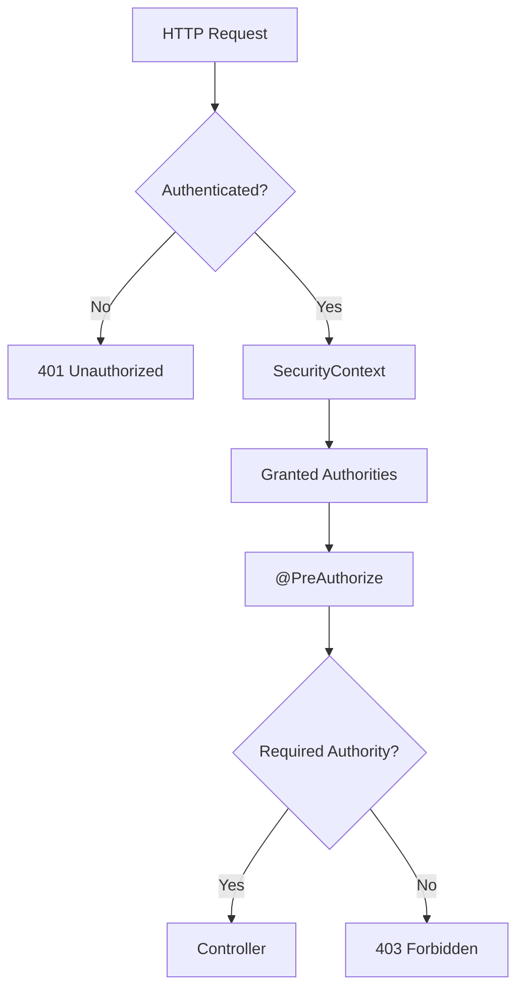
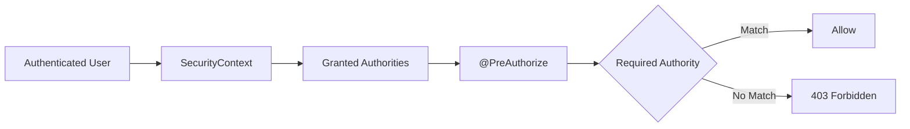

# Authorization

## 1. 전체 인가 흐름



## 2. Role → Permission → Authority
```mermaid
flowchart LR
    A[Authenticated User]
        --> B[SecurityContext]

    B --> C[Granted Authorities]

    C --> D{@PreAuthorize}

    D --> E{Required Authority}

    E -- Match --> F[Allow]
    E -- No Match --> G[403 Forbidden]
```

## 3. API 접근 제어


## 4. 401 / 403
| 상황                       | HTTP Status | 의미                |
| ------------------------ | ----------: | ----------------- |
| 인증되지 않은 요청               |         401 | Authentication 필요 |
| JWT 인증 실패                |         401 | Authentication 실패 |
| 인증 성공 + 필요한 Authority 존재 | 200 / 정상 응답 | 접근 허용             |
| 인증 성공 + 필요한 Authority 없음 |         403 | 접근 거부             |


