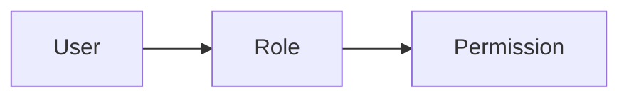

# RBAC Role / Permission Matrix

## 1. Purpose

본 문서는 시스템의 Role과 Permission 관계 및
각 Role에 부여되는 Permission 정책을 정의한다.

security-test-matrix.md는 해당 정책의 실제 테스트 검증 상태를 관리한다.


## 2. Role



## 3. Role

| Role  | Description |
| ----- | ----------- |
| USER  | 일반 사용자      |
| ADMIN | 관리자         |

## 4. Permission

| Permission  | Description         |
| ----------- | ------------------- |
| USER_READ   | 사용자 조회              |
| USER_CREATE | 사용자 생성              |
| USER_UPDATE | 사용자 수정              |
| USER_DELETE | 사용자 삭제              |
| ROLE_READ   | Role 조회             |
| ROLE_CREATE | Role 생성             |
| ROLE_UPDATE | Role 수정             |
| ROLE_DELETE | Role 삭제             |
| ROLE_ASSIGN | Role에 Permission 할당 |
| MENU_READ   | 메뉴 조회               |


## 5. Role / Permission Matrix

| Permission  | USER | ADMIN |
| ----------- | :--: | :---: |
| USER_READ   |   ✅  |   ✅   |
| USER_CREATE |   ❌  |   ✅   |
| USER_UPDATE |   ❌  |   ✅   |
| USER_DELETE |   ❌  |   ✅   |
| ROLE_READ   |   ❌  |   ✅   |
| ROLE_CREATE |   ❌  |   ✅   |
| ROLE_UPDATE |   ❌  |   ✅   |
| ROLE_DELETE |   ❌  |   ✅   |
| ROLE_ASSIGN |   ❌  |   ✅   |
| MENU_READ   |   ✅  |   ✅   |


## 6. Authorization Policy

### USER

일반 사용자에게 부여되는 Permission:

- USER_READ
- MENU_READ

### ADMIN

관리자에게 부여되는 Permission:

- USER_READ
- USER_CREATE
- USER_UPDATE
- USER_DELETE
- ROLE_READ
- ROLE_CREATE
- ROLE_UPDATE
- ROLE_DELETE
- ROLE_ASSIGN
- MENU_READ


## 8. Security Rule

RBAC 권한 검증은 다음 원칙을 따른다.

```text
Unauthenticated
        ↓
       401

Authenticated
        ↓
Permission exists?
   ↓           ↓
  YES          NO
   ↓           ↓
  200         403
```

