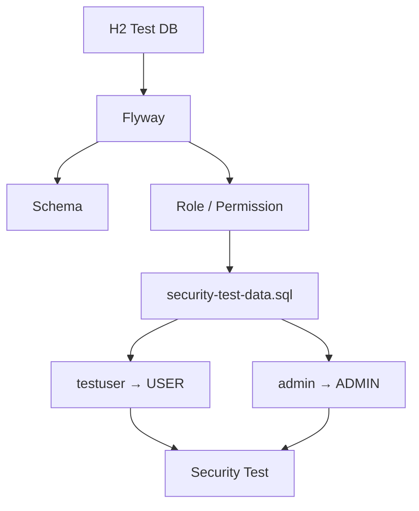
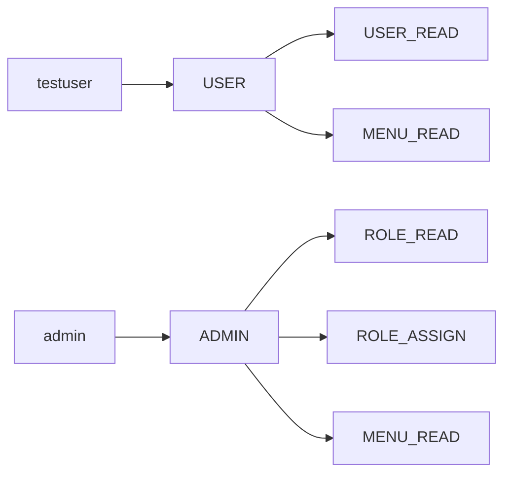

# Security Test Data

## 1. 목적

Security 테스트에서 사용하는 H2 테스트 DB와 SQL Fixture의 구성을 정의한다.

주요 목적은 다음과 같다.

* 테스트용 User / Role 구성
* Role / Permission 관계 검증
* Authentication / Authorization 테스트 지원
* 401 / 403 테스트 데이터 제공

---

## 2. 테스트 데이터 구성

테스트 환경은 `test` 프로필의 H2 인메모리 DB를 사용하며, Flyway가 Schema와 기본 IAM 데이터를 구성한다.



| 구분                       | 담당                                |
| ------------------------ | --------------------------------- |
| H2                       | 테스트 전용 DB                         |
| Flyway                   | Schema 및 기본 Role / Permission     |
| `security-test-data.sql` | 테스트 User 및 User-Role 관계           |
| Security Test            | Authentication / Authorization 검증 |

---

## 3. Test Users

Security Fixture에서 사용하는 테스트 사용자는 다음과 같다.

| User       | Status   | Role    | 목적            |
| ---------- | -------- | ------- | ------------- |
| `testuser` | `ACTIVE` | `USER`  | 일반 사용자 권한 테스트 |
| `admin`    | `ACTIVE` | `ADMIN` | 관리자 권한 테스트    |

실제 운영 사용자 및 개인정보는 테스트 데이터로 사용하지 않는다.

Fixture 파일:

```text
src/test/resources/sql/security-test-data.sql
```

---

## 4. Role / Permission

기본 Role과 Permission은 Flyway에서 구성한다.

### Role

| Role    | 목적     |
| ------- | ------ |
| `USER`  | 일반 사용자 |
| `ADMIN` | 관리자    |

### 주요 Permission

| Permission    | 목적                  |
| ------------- | ------------------- |
| `USER_READ`   | 사용자 조회              |
| `ROLE_READ`   | Role 조회             |
| `ROLE_ASSIGN` | Role에 Permission 할당 |
| `MENU_READ`   | 메뉴 조회               |

전체 Permission 및 RBAC 정책은 `rbac.md`를 기준으로 한다.

---

## 5. User → Role → Permission



`security-test-data.sql`은 Role과 Permission 자체를 생성하지 않고, Flyway에서 생성된 Role을 기준으로 User와 연결한다.

---

## 6. 테스트별 데이터 사용

| 테스트                             | 주요 데이터              | 방식                 |
| ------------------------------- | ------------------- | ------------------ |
| `PermissionIntegrationTest`     | Permission          | Flyway             |
| `RolePermissionIntegrationTest` | Role / Permission   | Flyway             |
| `RbacSecurityIntegrationTest`   | `testuser`, `admin` | SQL Fixture + JWT  |
| `SecurityIntegrationTest`       | `testuser`, `admin` | SQL Fixture + JWT  |
| `MenuSecurityIntegrationTest`   | `MENU_READ` 등       | Mock JWT Authority |
| `AuthServiceTest`               | Mock User           | Mockito            |

`MenuSecurityIntegrationTest`와 `AuthServiceTest`는 `security-test-data.sql`에 의존하지 않는다.

---

## 7. 테스트 데이터 원칙

* 테스트 DB는 H2 인메모리 DB를 사용한다.
* Schema와 기본 IAM 데이터는 Flyway가 관리한다.
* 테스트 User는 `security-test-data.sql`에서 관리한다.
* 기본 Role / Permission을 Fixture에서 중복 생성하지 않는다.
* 실제 운영 데이터를 사용하지 않는다.
* 인증 성공은 200, 인증 실패는 401, 권한 부족은 403을 기준으로 검증한다.
